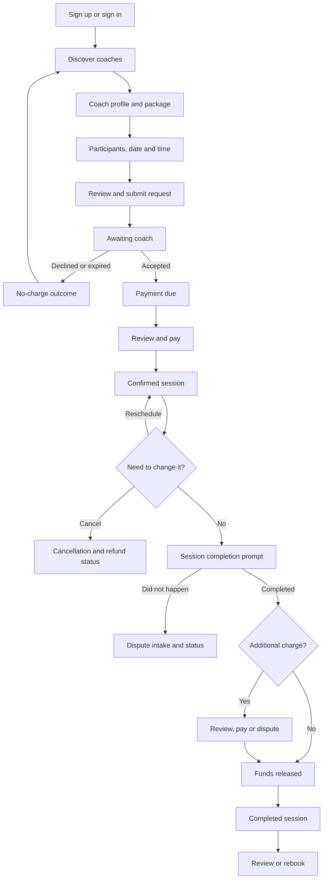
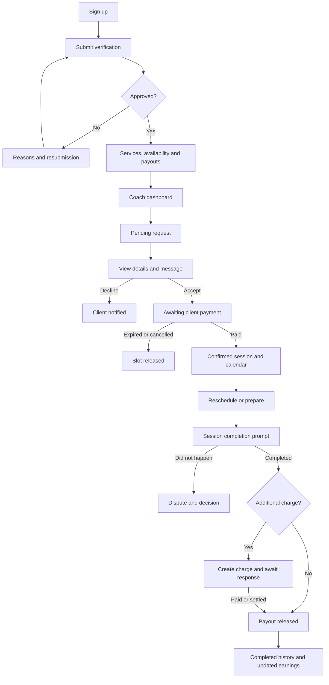

# CoachLink Prototype Flow & UI Audit

**Audit date:** 17 August 2026  
**Last implementation update:** 18 August 2026

**Scope:** Client and coach mobile prototype flow audit plus phased prototype implementation tracking.
**Sources reviewed:** `Client journey flowchart.pdf`, `Coach journey flowchart.pdf`, the registered prototype routes, shared UI primitives, theme tokens, mock data, and representative screens in the running prototype.

## Executive summary

CoachLink already has a strong pre-session foundation. Discovery, coach profiles, packages, availability, request submission, messaging, client booking lists, coach request handling, account settings, and basic earnings/history are represented. The visual direction is also strongest on Client Discover, Client Sessions, and Coach Dashboard: the green brand palette, rounded cards, Outfit/Inter type pairing, and compact status chips feel coherent and appropriately premium.

The largest gaps are not basic screens. They are the states that connect the screens into a trustworthy end-to-end journey:

1. **Accepted but unpaid is treated as confirmed/upcoming.** The PDFs require a separate awaiting-payment state.
2. **The client payment CTA is not wired to the payment screen.** It calls a missing `payBooking` prop instead of opening the existing Payment route.
3. **Session completion confirmation is missing for both roles.** Nothing moves an upcoming session through confirmation, payout release, and completed history.
4. **Dispute and evidence flows are missing.** Generic support chat does not cover issue type, evidence, review status, or the decision.
5. **Additional/outstanding charge flows are missing.** Neither role can create, review, approve, pay, or dispute an additional charge.
6. **Verification rejection/resubmission is missing from the visible coach flow**, even though rejected state data and a reusable banner already exist.
7. **Several lifecycle statuses disappear from lists.** Client `declined` requests and coach `cancelled` bookings are excluded from their list filters.
8. **Some screens are present but not inspectable from the screen directory** because required demo parameters are not supplied; both booking-detail routes currently open as “Booking not found” when selected directly.

Recommendation: preserve the current visual language, fix the lifecycle state model first, then add a small set of role-aware status screens. The most distinctive and useful new design pattern should be a shared **Session Journey Timeline** used on both client and coach booking details.

> **Implementation update — 18 August 2026:** Phases 1–4 are complete. The original request/payment, exception, consistency, and accessibility findings below are retained as the audit baseline; each implemented result is summarized in the completion sections near the end of this document.

## What exists today

There are now **68 registered routes** after the Phase 3 exception-journey additions:

| Area | Registered routes | General assessment |
|---|---:|---|
| Onboarding/auth | 16 | Full verification submission, pending, approval, rejection, and targeted resubmission coverage |
| Client | 28 | Discovery, request, session lifecycle, history, and additional-payment review coverage |
| Coach | 18 | Setup/dashboard/profile, payment/session lifecycle, and additional-payment creation coverage |
| Shared | 6 | Messaging, support, session completion, funds release, dispute intake, and case outcomes |

### Strongest existing areas

- Client discovery: search, filters, list/map/favorites, location context, package browse.
- Coach profile: identity, verification, reviews, reels, packages, availability, sticky booking CTA.
- Booking request: participant selection, date/time, safety information, review, request-sent confirmation.
- Client session management: pending/upcoming/completed tabs, reschedule sheet, cancellation summary, refund calculation UI, review/rebook actions.
- Coach setup: identity details, expertise, verification upload, services, availability, payout setup.
- Coach operations: dashboard, request cards, bookings list/calendar, availability manager, messages, profile, earnings, payout receipts.
- Account surfaces: profile editing, family/participant profiles, payment methods, notifications, security, privacy, support, history.

### Status legend used below

- **Covered:** the route/state exists and represents the PDF step well.
- **Partial:** the function exists, but the route, state, outcome, or role-specific context is incomplete.
- **Missing:** no usable screen/state represents the PDF step.
- **Broken:** the intended interaction is present visually but cannot complete correctly in the prototype.

## Client journey comparison

| PDF journey stage | Current prototype | Status | Required action |
|---|---|---|---|
| Sign up, account/profile setup, sign in | `role-select`, `auth`, `verify-email`, `enable-biometric`, `about-you-profile`, `client-setup-complete` | Covered | Keep current structure; improve form semantics and labels |
| Home/discover, list/map, search, notifications | `client-home`, `search-filters`, `notifications` | Covered | Treat this as the reference visual standard for the rest of the app |
| View coach profile, packages, reels, reviews, availability | `coach-profile`, `package-detail`, `package-listing`, `availability-calendar` | Covered | Increase icon-button touch targets and accessibility labels |
| Select participant, date, time and submit request | `booking-participants`, `booking-select-datetime`, `booking-datetime`, `booking-participant-details`, `booking-review`, `booking-request-sent` | Covered | Rename the two date/time steps so “choose” and “confirm/repeat” are unambiguous |
| Pending request: withdraw, message coach, contact support | Pending tab, withdraw sheet, chat, booking detail support CTA | Covered | Add “View request” to the request-sent screen |
| Coach declines request; no payment collected | Notification can deep-link to booking detail; `bookingDeclined` banner exists but is barely used | Partial | Add a clear declined/expired outcome state and keep declined requests in history |
| Coach accepts and sends payment prompt | Notification data and a payment-due card exist | Broken | Introduce `awaiting_payment`; do not mark the session confirmed/upcoming yet |
| Review payment details, choose method, confirm payment | `payment`, `payment-add-card` | Broken entry | Route the Pay CTA to `payment` with `bookingId`; do not bypass the review screen |
| Booking confirmed; update calendar/session list | Confirmation UI exists, but the accepted-request payment path returns to booking detail | Partial | Repurpose `booking-confirmation` as the post-payment success screen |
| Upcoming: reschedule, cancel, message | Booking card/detail plus reschedule and cancellation sheets | Mostly covered | Sync reschedules to the coach state and notify the coach |
| Review cancellation, refund policy and amount | Detailed cancellation sheet | Covered visually | Unify `paid` and `paymentDue`; current seeded bookings can show a refund but fail to create refund status |
| Refund notification/status | `refund-status` and refund banners | Partial | Ensure every paid cancellation creates a visible refund timeline and notification |
| Confirm whether session was completed | No user-facing completion prompt or transition | Missing | Add shared completion-confirmation screen with client variant |
| File dispute, describe issue, attach evidence/chat | Generic `support` chat only | Missing | Add structured dispute intake with issue category, description, evidence, and chat-history preview |
| Admin review and dispute decision | No role-facing tracking/outcome surface | Missing | Add dispute status timeline and accepted/dismissed outcome variants |
| Review and approve additional/outstanding charges | No screen/state | Missing | Add additional-charge review, approve/pay, and dispute actions |
| Payment released; move to completed; leave review | Completed list and leave-review screen exist, but there is no lifecycle transition into them | Partial | Connect completion confirmation to release status, completed history, and review prompt |

## Coach journey comparison

| PDF journey stage | Current prototype | Status | Required action |
|---|---|---|---|
| Sign up and submit verification documents | `auth`, `coach-info`, `coach-expertise`, `verification` | Covered | Keep current structure |
| Await admin review | `verification-pending` | Covered | Add review timeline/expected date only if needed |
| Verification rejected, reasons shown, resubmit documents | Context can become `rejected`; reusable `verificationRejected` state exists | Missing in UI | Render rejection reasons, affected documents, and “Update documents” CTA |
| Approved coach completes services, availability and payouts | `coach-services-setup`, `coach-availability-setup`, `coach-payout-setup`, `coach-setup-complete` | Covered | Use one consistent step-progress pattern across all setup screens |
| Dashboard: earnings, pending requests, upcoming sessions, reviews, notifications | `coach-dashboard` | Covered | On smaller phones show 2 pending requests, then “See all,” to reduce density |
| View request, client details, message, accept/decline | `coach-bookings`, `coach-booking-detail`, `chat-thread` | Broken on detail action | Fix the undeclared notification call and centralize notifications in the state layer |
| Accept request, request payment, keep booking pending | Acceptance immediately sets `confirmed` | Broken | Add `awaiting_payment` and a payment-deadline card/timeline |
| Reminder before payment deadline | No state/screen | Missing | Add reminder state with “Message client” and deadline information |
| Payment window expires and session is cancelled | `expired` is recognized in one list and a reusable banner exists, but no transition/UI | Missing | Add expired outcome and make the slot visibly available again |
| Client pays; move to upcoming/calendar | Notification exists; coach booking was already moved earlier | Partial | Move to upcoming only when payment succeeds |
| Coach reschedules a confirmed session | No coach reschedule flow | Missing | Add reschedule to confirmed session detail and notify the client |
| Confirm session completion | No role-facing confirmation screen/action | Missing | Add shared completion-confirmation screen with coach variant |
| File dispute and attach evidence/chat | Generic support only | Missing | Use the shared structured dispute intake |
| No-show compensation or client refund decision | No role-facing outcome screen | Missing | Add dispute decision and compensation/refund variants |
| Add additional/outstanding charge and notify client | No screen/state | Missing | Add charge builder with reason, amount, receipt/photo evidence, and preview |
| Wait for additional payment or dispute resolution | No screen/state | Missing | Add additional-charge timeline and status actions |
| Payout released and balance updated | Earnings/history/payout receipt exist | Partial | Connect completion/dispute resolution to a payout-release status and updated balance |

## Missing screen backlog

These can be implemented as **10 screen families**, several of which should be shared and role-aware rather than duplicated.

| Priority | Suggested route/screen family | Role | Minimum screen content |
|---|---|---|---|
| P0 | `verification-rejected` | Coach | Rejection headline, admin reasons per document, document status, update/resubmit CTA, support link |
| P0 | `booking-awaiting-payment` | Coach | Accepted summary, payment deadline/countdown, client notification sent, message client, cancel/expire state |
| P0 | `booking-declined` / `booking-expired` state | Client | No-charge confirmation, coach/request summary, message if available, find another coach/rebook CTA |
| P0 | `session-completion` | Shared, role-aware | Session summary, “Did this session take place?”, yes/no actions, explanation of payout/dispute consequence |
| P0 | `dispute-create` | Shared, role-aware | Issue category, description, amount requested, evidence upload, included chat history, review-before-submit |
| P0 | `dispute-status` | Shared, role-aware | Submitted/reviewing/decided timeline, evidence summary, support thread, accepted/dismissed outcome |
| P0 | `additional-charge-create` | Coach | Charge reason, amount, evidence/receipt, client preview, send request CTA |
| P0 | `additional-charge-review` | Client | Coach explanation, itemized amount, approve & pay, ask question, dispute CTA |
| P1 | `coach-session-detail` | Coach | Confirmed/upcoming/completed variants, payment status, reschedule, message, completion action, support |
| P1 | `funds-release-status` | Shared, role-aware | Escrow/payout timeline, amount breakdown, expected release date, refund/compensation outcome |

### Reuse before creating new components

The state system already defines visual treatments for `bookingDeclined`, `bookingExpired`, `sessionCompleted`, `verificationRejected`, `paymentRefunded`, and `refundProcessing`. These are currently unused or only lightly used. Reuse them inside the new routes instead of designing duplicate status components.

## Critical flow and prototype issues

These should be fixed before adding visual polish because they make valid-looking screens lead to incorrect or broken outcomes.

| Priority | Finding | Evidence | Recommendation |
|---|---|---|---|
| P0 | Accepted but unpaid is stored as `confirmed` and shown in Upcoming for both roles | `src/context/AppContext.jsx:223-236`, `src/screens/client/Dashboard.jsx:105`, `src/screens/coach/CoachDashboard.jsx:93` | Add `awaiting_payment`; move to `confirmed` only after successful payment |
| P0 | Client Pay buttons call missing `payBooking` | `src/screens/client/Dashboard.jsx:92`, `:143`, `:594`, `:765`; context exposes `markBookingPaid` at `src/context/AppContext.jsx:364` | Navigate to `payment` with `bookingId`, then call `markBookingPaid` after success |
| P0 | Coach booking-detail response references undeclared `pushNotification` | `src/screens/coach/Bookings.jsx:179`, `:197` | Let `respondBooking` own notifications; remove screen-level duplicate notification logic |
| P0 | Coach Dashboard acceptance can create two conflicting client notifications | `respondBooking` sends “Send your payment,” then dashboard sends “Booking confirmed” | Send one notification based on the authoritative lifecycle state |
| P0 | Declined client requests disappear from all Client Sessions tabs | Client filters only `pending`, `confirmed`, `completed`, `cancelled` in `src/screens/client/Dashboard.jsx:104-107` | Include `declined` and `expired` in History/Completed with clear status actions |
| P0 | Client-cancelled coach bookings disappear from coach lists | Coach completed filter omits `cancelled` in `src/screens/coach/Bookings.jsx:60` | Include `cancelled`; show who cancelled, reason if known, and slot-release state |
| P0 | Refund UI and refund state use different payment truth checks | Sheet assumes paid when `!paymentDue` at `src/screens/client/Dashboard.jsx:407`; action requires `target.paid` at `src/context/AppContext.jsx:196` | Replace with one explicit payment state, e.g. `paymentStatus: unpaid/held/refunded/released` |
| P0 | Client reschedule updates only the client array | `src/context/AppContext.jsx:208-209` | Update the linked coach booking and generate a coach notification |
| P0 | Verification rejection is never rendered | `ScreenVerificationPending` only distinguishes approved vs everything else at `src/screens/onboarding/OnboardingScreens.jsx:1203-1249` | Add explicit pending/approved/rejected variants |
| P1 | FAQ payment copy contradicts the PDF and current request-first flow | `src/data/bookings.js:104` says the card is charged at booking time | Change to: payment is requested after coach acceptance; funds are held after payment |
| P1 | Direct screen-directory inspection fails for parameterized routes | Booking detail screens show “Booking not found” without an ID | Add `demoParams` to route metadata and set params when a directory item is opened |
| P1 | Five screen exports are not registered | `ScreenAccountType`, `ScreenAboutYouParticipants`, `ScreenAboutYouSelf`, `ScreenCoachProfileSetup`, `ScreenAdminLogin` | Register intentional screens or remove/archive dead prototype branches; `account-type` routes currently point nowhere |
| P1 | `booking-confirmation` is largely disconnected from the current request-first journey | New requests go to `booking-request-sent`; accepted payment returns to booking detail | Make it the definitive post-payment success screen or remove it from the directory |

## Existing screens that need UI/UX improvement

### Client Discover — `src/screens/client/Discovery.jsx`

Keep the current visual structure. Improve the unnamed search/filter/clear icon buttons, enlarge the 26 px filter target to at least 44 px, and make active filters readable as removable buttons rather than button-inside-text-chip patterns. Add a concise no-results recovery card with “Clear filters” and “Expand distance.”

### Coach Profile — `src/screens/client/CoachProfile.jsx`

The content hierarchy is good, but the 34 px back/favorite/share controls are below the 44 px touch target. Add accessible labels, replace remaining hardcoded banner colors with theme tokens, and make the selected package/date/time state more visually persistent above the sticky CTA.

### Booking flow — `src/screens/client/Booking.jsx` and `BookingExtra.jsx`

The flow has both `booking-select-datetime` and `booking-datetime`; in the directory they read like duplicates. Rename them to **Choose date & time** and **Confirm schedule**, with the second screen clearly owning repeat options and price calculation. Keep one step indicator style throughout. Replace raw light-mode fills and `transition: all` with tokens and explicit transition properties.

### Booking Request Sent — `src/screens/client/Booking.jsx`

Add a booking summary, expected response time, payment explanation, and a primary **View request** CTA using the booking ID already passed to the route. “Return to home” should be secondary.

### Client Sessions and Booking Detail — `src/screens/client/Dashboard.jsx`

This is visually solid, especially the segmented states and cancellation summary. The next improvement is a role-aware Session Journey Timeline so the user always knows whether the request is awaiting a coach, awaiting payment, confirmed, completed, under dispute, or refunded. Declined/expired should remain visible in history. Payment should open the full payment screen rather than act inline.

### Coach Dashboard — `src/screens/coach/CoachDashboard.jsx`

The hero stats and request cards are strong. On short screens it is too dense: show only the first 2 pending requests, keep “See all,” and surface the next confirmed session above recent reviews. After adding `awaiting_payment`, include a compact “Waiting for payment” section rather than counting those sessions as Upcoming.

### Coach Calendar — `src/screens/coach/Calendar.jsx`

The bottom tab says **Calendar**, but the screen title and primary behavior are **Availability**. Either rename the tab to Availability, or create a segmented Calendar screen with **Schedule** and **Availability**. The PDF expects the coach to see sessions and reschedule them, not only edit bookable slots.

### Coach Bookings and Booking Detail — `src/screens/coach/Bookings.jsx`

The detail screen is titled “Booking request” for every status. Use status-specific variants:

- Pending: request details, message, accept, decline.
- Awaiting payment: deadline, reminder status, message, expire/cancel.
- Confirmed: session preparation, reschedule, message, completion.
- Completed/cancelled/declined/expired: outcome summary, payment/payout/refund status, support.

### Support — `src/screens/support/Support.jsx`

Keep FAQ and chat for ordinary help. A dispute must not be represented as an ordinary chat message. Add a structured intake route and deep-link it from “Session did not happen,” cancellation problems, and additional-charge disagreements.

### Client/Coach Account screens

Both account screens have good functional coverage, but they are long. Preserve the grouped sections and sheets, while standardizing section spacing and destructive-action layouts. Use the shared layout tokens instead of repeated `18`, `24`, and radius values.

## Visual consistency recommendations

### 1. Make the Session Journey Timeline the signature CoachLink pattern

Use one shared vertical timeline on booking details:

`Request sent → Coach accepted → Payment due → Confirmed → Session → Completion confirmed → Funds released`

Each role sees the same lifecycle with role-specific copy and next action. This is more distinctive than adding decorative gradients and directly solves the largest trust problem in the current prototype.

### 2. Use the existing token system everywhere

- Replace remaining raw screen colors in `CoachProfile.jsx`, `Booking.jsx`, and onboarding with `C.*` tokens.
- Use `T.*` for the remaining raw font sizes in shared mobile primitives.
- Use `LAYOUT.pagePadX`, radii, CTA padding, and tab clearance instead of repeating literals.
- Change `LAYOUT.ctaPadBottom` from 24 to the approved safe-area value and combine it with `env(safe-area-inset-bottom)` in the browser prototype.

### 3. Standardize action hierarchy

- One primary action per screen.
- Secondary actions use outline/secondary.
- Destructive actions use danger and require confirmation.
- Icon-only actions are reserved for universally understood utilities and must still have accessible labels.
- Keep payment, submit-request, accept, completion, refund, and dispute actions full-width and bottom-pinned when they are the step’s main decision.

### 4. Standardize status language

Use these labels consistently across lists, notifications, details, and history:

| Internal state | User-facing label |
|---|---|
| `pending_coach` | Awaiting coach |
| `awaiting_payment` | Payment due |
| `confirmed` | Confirmed |
| `completion_pending` | Confirm completion |
| `disputed` | Under review |
| `additional_payment_due` | Additional payment due |
| `completed` | Completed |
| `cancelled` | Cancelled |
| `declined` | Declined |
| `expired` | Request expired |
| `refunded` | Refunded |

Avoid using “confirmed” before payment has been completed.

### 5. Improve compact-device behavior

- Validate all screens at 375 × 667 as well as 393 × 852.
- Keep dashboard summaries above lists, but cap previews at 2 items on shorter heights.
- Ensure sticky CTAs and the floating bottom tab bar never cover the last row.
- Long coach names, handles, service names, suburbs, and translated copy should wrap or truncate deliberately.

## Accessibility and interaction audit

The prototype was visually polished but needed a systematic accessibility pass. The items below are retained as the pre-Phase 4 baseline.

1. **Clickable cards are `
`.** `Card` should render a semantic button/link when interactive, or add keyboard behavior and focusability. Current cards are not keyboard reachable.
2. **Field labels are visual `
` elements.** The shared `Field` component should generate a stable input ID and semantic `<label htmlFor>`, plus `name`, `autoComplete`, and appropriate `inputMode`.
3. **Icon-only buttons often have no accessible name.** Examples include search filters, clear-filter controls, favorite/share, message buttons, and calendar arrows.
4. **Many touch targets are below 44 px.** Common examples are 26–38 px icon buttons and small chips.
5. **Focus indicators are removed globally.** Inputs and tabs use `outline: none`; add a visible `:focus-visible` treatment rather than relying only on border color.
6. **Bottom sheets need dialog behavior.** Add `aria-modal`, accessible title linkage, initial focus, focus containment, Escape handling, and scroll containment.
7. **Animations do not honor reduced motion.** This recommendation was intentionally excluded from Phase 4 because CoachLink is being delivered as a visual prototype; its premium motion language remains unchanged by product direction.
8. **Dark mode needs native integration.** Set `color-scheme` on the root and update `theme-color`; audit the remaining raw light colors.
9. **Avoid `transition: all`.** It appears in shared tabs and several booking/profile controls; list only the properties being animated.
10. **Images should have explicit dimensions where practical.** Reels and uploaded profile previews currently rely mainly on CSS sizing.

Reference used for this pass: Vercel Web Interface Guidelines, fetched on the audit date.

> **Phase 4 resolution:** Items 1–6 and 8–10 are resolved across the shared primitives and the rendered route set. Interactive cards are keyboard reachable, shared fields use semantic labels, icon actions have accessible names, all rendered buttons meet the 44 px minimum, visible focus treatments are restored, bottom sheets have modal/focus/Escape/scroll behavior, dark mode now integrates `color-scheme` and `theme-color`, broad transitions were removed, and shared imagery has explicit dimensions where applicable. Reduced-motion behavior remains intentionally out of scope.

## Recommended target flows

### Client

### Coach

## Recommended order of work

### Phase 1 — Make the existing journey truthful — Completed 17 August 2026

- [x] Add the authoritative lifecycle/payment state model.
- [x] Fix payment navigation and notification ownership.
- [x] Keep declined, expired, and cancelled items visible in history.
- [x] Sync reschedules and cancellations across both role views.
- [x] Add deterministic demo parameters for every screen-directory route.

Implementation result: coach acceptance now moves a request to `awaiting_payment`; successful payment is the only transition to `confirmed`. Client and coach booking records receive the same lifecycle, schedule, cancellation, refund, and payment updates. The Payment screen owns payment confirmation, the context owns lifecycle notifications, terminal outcomes remain visible in History, and all 59 directory routes receive clean demo parameters when opened directly.

### Phase 2 — Complete the main session lifecycle — Completed 18 August 2026

- [x] Coach awaiting-payment/deadline state.
- [x] Client payment-due and post-payment confirmation.
- [x] Coach confirmed session detail/reschedule.
- [x] Shared completion confirmation.
- [x] Funds-release/payout status.

Implementation result: CoachLink now uses a shared, role-aware **Session Journey Timeline** from request through funds release. Coaches can see the payment deadline, send one reminder, message the client, or close the payment window and release the slot. Successful client payment opens a definitive confirmation screen and synchronizes the same booking into the coach schedule. Confirmed coach sessions have status-specific details, secure-payment context, messaging, rescheduling, support, and completion actions. Either role can open the shared completion decision; confirmation moves funds through processing to released, updates both booking records, creates role-specific notifications, and surfaces the result in client history, coach history, earnings, and the new payout/payment detail screen. Coach Calendar now separates **Schedule** and **Availability**, and all four Phase 2 routes include deterministic directory demo data.

### Phase 3 — Complete exception journeys — Completed 18 August 2026

- [x] Verification rejection/resubmission.
- [x] Dispute intake and tracking.
- [x] Additional charge request/review/payment/dispute.
- [x] No-show compensation and client refund outcomes.

Implementation result: verification now has a dedicated rejection state with per-document decisions, actionable review reasons, preserved approved documents, and a targeted resubmission path. Both roles can open a structured two-step session report with issue category, statement, requested amount, evidence, optional session chat, and a review-before-submit checkpoint. Submitted cases share one role-aware status record with protected-funds messaging, evidence summary, a three-stage review timeline, support access, and resolved no-show variants for client refunds, coach compensation, or no adjustment. Coaches can create an additional payment with an agreed reason, amount, client-facing explanation, evidence, and exact client preview; clients can approve and pay, ask a question, or escalate the request into the same dispute system. Booking details on both sides surface live case and charge records, and the session-completion “did not happen” branch now opens structured intake rather than generic support.

### Phase 4 — Consistency and accessibility — Completed 18 August 2026

- [x] Token and layout cleanup.
- [x] Semantic fields, buttons, cards, dialogs, and focus states.
- [x] 44 px touch targets and safe areas.
- [x] Dark-mode native integration.
- [x] Compact-device and long-content QA.
- [x] Preserve the existing prototype motion system; reduced-motion variants are intentionally not included.

Implementation result: shared primitives now enforce the CoachLink radius, typography, color, spacing, focus, and 44 px interaction standards across client, coach, onboarding, messaging, support, and lifecycle screens. Bottom actions and sheets use safe-area-aware padding; sheets include accessible dialog naming, focus entry/containment/restoration, Escape dismissal, and scroll containment. Fields, OTP inputs, switches, segmented controls, rating stars, calendar navigation, menus, notifications, message actions, and clickable cards now expose consistent semantics and accessible names. Raw mobile-screen colors and `transition: all` exceptions were removed, native light/dark browser integration was added, and fixed dark hero/status surfaces retain correct contrast in either theme. A rendered audit of all 68 registered routes at the iPhone SE 375 × 667 and iPhone 15 393 × 852 presets found no screen render failures, no root horizontal overflow, no visible controls below 44 px, and no remaining unnamed buttons or unlabeled visible form controls. The production build passes; the existing non-blocking bundle-size warning remains appropriate for this single-bundle prototype.

## Definition of done for the prototype

- Every PDF branch has a visible client/coach outcome, even when admin action is simulated.
- Every registered directory screen opens with meaningful demo data.
- The same booking shows the same lifecycle status in client, coach, notifications, calendar, history, and earnings.
- A request is not “confirmed” until payment succeeds.
- Completion, dispute, additional-charge, refund, and payout states have explicit next actions.
- All mobile screens use `C`, `T`, font, primitive, and layout tokens consistently.
- Every interactive target is at least 44 px and keyboard/focus accessible.
- Light/dark modes and 375 × 667 / 393 × 852 layouts are visually verified.
